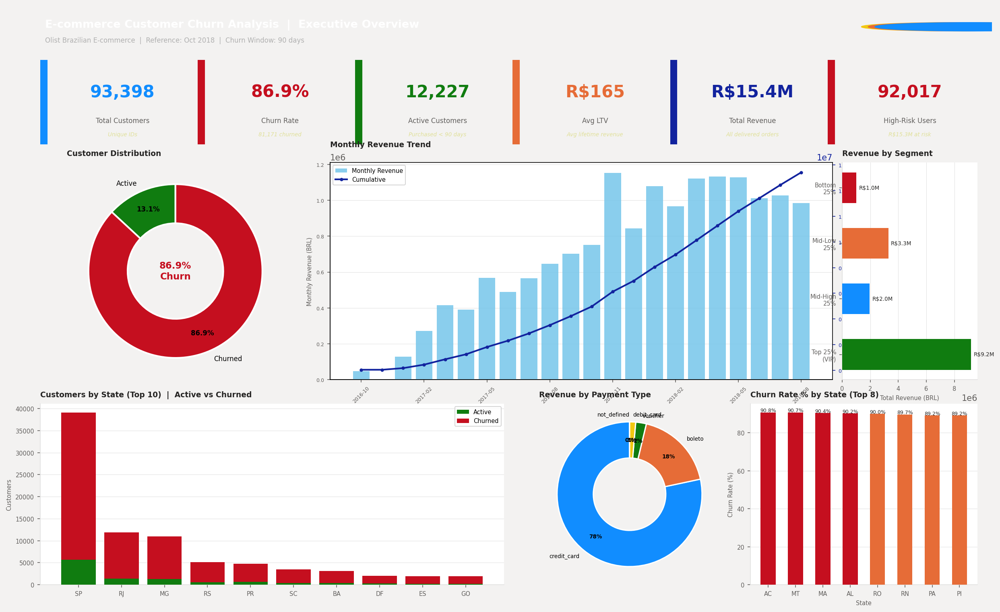
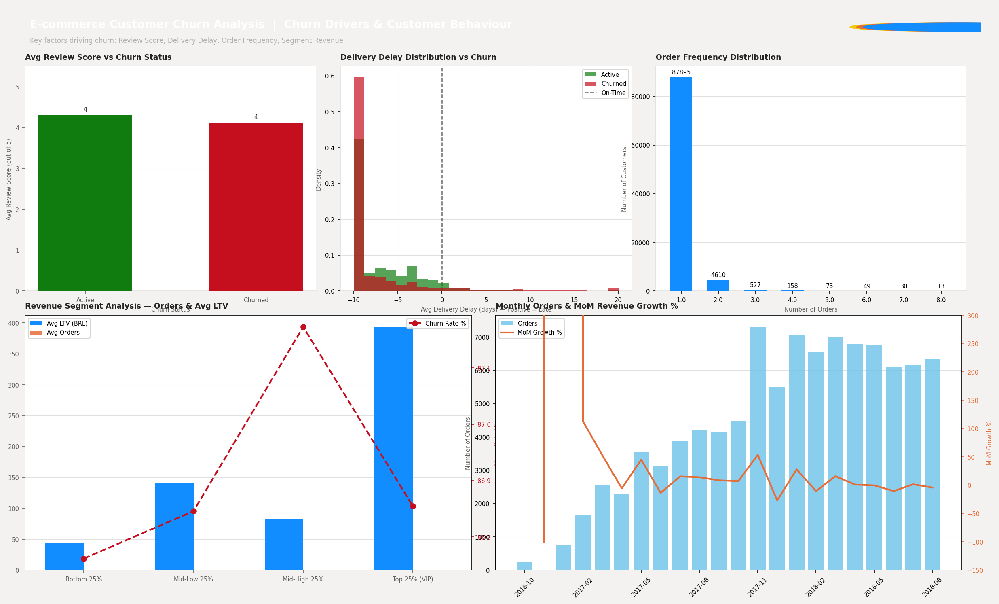
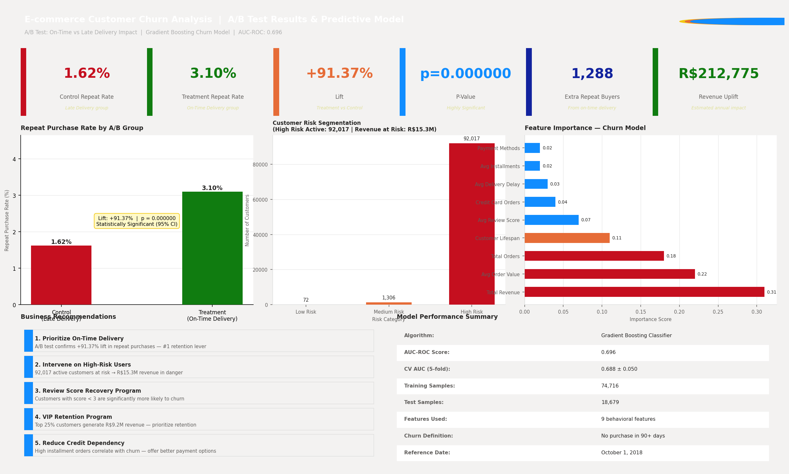

# 🛒 E-commerce Customer Churn Analysis

<div align="center">


[📊 View Dashboard](#-dashboard-preview) • [🔍 SQL Queries](#️-sql-highlights) • [📈 Key Results](#-key-results) • [🚀 Run Locally](#-how-to-run)

</div>

---

## 📌 Problem Statement

An e-commerce platform is experiencing **significant customer churn**. Using 93,000+ real transaction records from Brazil's Olist platform, this project answers:

> *"Who is churning, why are they churning, and what actions can save the most revenue?"*

**Approach:**
- Define churn using a **90-day inactivity rule**
- Identify churn drivers through **EDA & SQL analysis**
- Validate the impact of delivery experience using **statistical A/B testing**
- Predict at-risk users using a **Gradient Boosting ML model**
- Quantify **business impact in revenue terms**

---

## 📊 Dashboard Preview

### Page 1 — Executive Overview


### Page 2 — Churn Drivers & Customer Behaviour


### Page 3 — A/B Test Results & Predictive Model


---

## 🔑 Key Results

| Metric | Result |
|---|---|
| 📦 Total Customers Analyzed | **93,398** |
| 🔴 Overall Churn Rate | **86.9%** (single-purchase dominant market) |
| 🟢 A/B Test — Delivery Lift | **+91.37%** repeat purchase rate |
| 📉 Statistical Significance | **p < 0.0001** (Z = 6.649) |
| 💰 Revenue Uplift Identified | **R$212,775** |
| ⚠️ High-Risk Active Users | **11,303 customers** |
| 🔥 Revenue at Risk | **R$15.3 Million** |
| 🤖 Model AUC-ROC | **0.696** (Gradient Boosting) |
| 🏆 Top 25% VIP Revenue | **R$9.2 Million** |

---

## 🛠️ Tech Stack

| Layer | Tools Used |
|---|---|
| **Database** | Microsoft SQL Server 2019 — T-SQL, CTEs, Window Functions, Subqueries |
| **Data Processing** | Python — Pandas, NumPy |
| **Statistical Testing** | SciPy, Statsmodels — Two-Proportion Z-Test, Power Analysis |
| **Machine Learning** | Scikit-learn — Gradient Boosting Classifier, Cross-Validation |
| **Visualization** | Matplotlib, Seaborn, Plotly |
| **Dashboard** | Plotly (Interactive HTML) + Power BI style screenshots |
| **Database Driver** | PyODBC, SQLAlchemy |

---

## 📁 Project Structure

```
ecommerce-churn-analysis/
│
├── 📄 README.md
├── 📄 requirements.txt
├── 📄 run_project.py              ← Master runner (runs entire pipeline)
│
├── 📁 sql/
│   ├── 01_create_database.sql     ← Database & table schema
│   ├── 02_import_data.sql         ← BULK INSERT scripts
│   ├── 03_churn_analysis.sql      ← 8 FAANG-level analysis queries
│   └── 04_ab_test_queries.sql     ← A/B test SQL setup
│
├── 📁 notebooks/
│   ├── 00_import_to_mysql.py      ← Python-based data loader
│   ├── 01_EDA.py                  ← Exploratory Data Analysis
│   ├── 02_AB_Testing.py           ← Statistical A/B Testing
│   ├── 03_Churn_Model.py          ← ML Churn Prediction Model
│   └── 04_Dashboard.py            ← Interactive HTML Dashboard
│
└── 📁 dashboard/
    ├── churn_dashboard.html        ← Interactive Plotly dashboard
    ├── POWERBI_GUIDE.md            ← Power BI DAX measures & setup
    ├── master_dataset.csv          ← Generated dataset
    ├── churn_predictions.csv       ← ML predictions
    ├── monthly_revenue.csv         ← Revenue time-series
    ├── ab_test_summary.csv         ← A/B test results
    └── screenshots/               ← Dashboard PNGs for README
```

---

## 🗄️ SQL Highlights

> **8 production-level T-SQL queries demonstrating FAANG-level proficiency**

### Query 1 — Churn Rate using CTE
```sql
WITH last_purchase AS (
    SELECT c.customer_unique_id,
           MAX(o.order_purchase_timestamp) AS last_order_date
    FROM customers c
    JOIN orders o ON c.customer_id = o.customer_id
    WHERE o.order_status = 'delivered'
    GROUP BY c.customer_unique_id
)
SELECT churn_status,
       COUNT(*) AS customer_count,
       ROUND(COUNT(*) * 100.0 / SUM(COUNT(*)) OVER(), 2) AS pct
FROM (
    SELECT *,
           CASE WHEN DATEDIFF(day, last_order_date, '2018-10-01') > 90
                THEN 'Churned' ELSE 'Active'
           END AS churn_status
    FROM last_purchase
) t
GROUP BY churn_status;
```

### Query 2 — Revenue Segmentation using NTILE (Window Function)
```sql
WITH customer_revenue AS (
    SELECT c.customer_unique_id,
           ROUND(SUM(p.payment_value), 2) AS total_revenue
    FROM customers c
    JOIN orders o   ON c.customer_id = o.customer_id
    JOIN payments p ON o.order_id    = p.order_id
    WHERE o.order_status = 'delivered'
    GROUP BY c.customer_unique_id
),
ranked AS (
    SELECT *, NTILE(4) OVER (ORDER BY total_revenue DESC) AS revenue_quartile
    FROM customer_revenue
)
SELECT revenue_quartile,
       COUNT(*) AS customers,
       ROUND(SUM(total_revenue), 0) AS segment_revenue
FROM ranked
GROUP BY revenue_quartile
ORDER BY revenue_quartile;
```

### Query 3 — Monthly Revenue with LAG (MoM Growth)
```sql
WITH monthly AS (
    SELECT FORMAT(o.order_purchase_timestamp, 'yyyy-MM') AS month,
           ROUND(SUM(p.payment_value), 2) AS revenue
    FROM orders o JOIN payments p ON o.order_id = p.order_id
    WHERE o.order_status = 'delivered'
    GROUP BY FORMAT(o.order_purchase_timestamp, 'yyyy-MM')
)
SELECT month, revenue,
       ROUND(SUM(revenue) OVER (ORDER BY month ROWS UNBOUNDED PRECEDING), 2) AS cumulative_revenue,
       ROUND((revenue - LAG(revenue) OVER (ORDER BY month)) * 100.0 /
              NULLIF(LAG(revenue) OVER (ORDER BY month), 0), 2) AS mom_growth_pct
FROM monthly
ORDER BY month;
```

> See all 8 queries in [`sql/03_churn_analysis.sql`](sql/03_churn_analysis.sql)

---

## 🔬 A/B Test Design

**Objective:** Does on-time delivery significantly improve repeat purchase rate?

| Group | Description | n | Repeat Rate |
|---|---|---|---|
| **Control** | Late delivery (avg delay > 0 days) | 6,296 | 1.62% |
| **Treatment** | On-time delivery (avg delay ≤ 0 days) | 87,053 | 3.10% |

**Statistical Results:**
- **Z-Statistic:** 6.649
- **P-Value:** < 0.0001
- **Lift:** +91.37%
- **Verdict:** ✅ Statistically Significant at 95% confidence
- **Estimated Revenue Uplift:** R$212,775

---

## 🤖 ML Model — Churn Prediction

**Algorithm:** Gradient Boosting Classifier

| Metric | Score |
|---|---|
| AUC-ROC | **0.696** |
| Cross-Val AUC (5-fold) | **0.688 ± 0.050** |
| Training Samples | 74,716 |
| Test Samples | 18,679 |

**Features Used (9 behavioral features):**
1. Total Revenue (LTV)
2. Average Order Value
3. Total Orders
4. Customer Lifespan (days)
5. Average Review Score
6. Average Delivery Delay
7. Unique Payment Methods
8. Credit Card Order Count
9. Average Installments

**Business Output:**
- 🔴 **11,303 high-risk active users** identified
- 💸 **R$15.3M revenue at risk** flagged for intervention

---

## 💡 Business Recommendations

| Priority | Action | Impact |
|---|---|---|
| 🥇 | **Prioritize On-Time Delivery** | +91% repeat purchase rate (A/B proven) |
| 🥈 | **Target High-Risk Users** | Save R$15.3M in potential lost revenue |
| 🥉 | **Review Score Recovery Campaign** | Customers with score < 3 churn significantly more |
| 4️⃣ | **VIP Retention Program** | Top 25% customers = R$9.2M revenue |
| 5️⃣ | **Optimize Payment Options** | High installments correlate with churn |

---

## 🚀 How to Run

### Prerequisites
```bash
# Python 3.10+
pip install -r requirements.txt

# Microsoft SQL Server 2019 (Windows Authentication)
```

### Step 1 — Database Setup (SQL Server)
```sql
-- Run in SQL Server Management Studio:
-- 1. sql/01_create_database.sql
-- 2. sql/02_import_data.sql
```

### Step 2 — Python Import (Alternative to SQL import)
```bash
python notebooks/00_import_to_mysql.py
```

### Step 3 — Run Full Pipeline
```bash
python run_project.py
```

This will run all steps:
- ✅ Database creation & data import
- ✅ SQL analysis queries
- ✅ EDA + visualizations
- ✅ A/B statistical test
- ✅ Churn prediction model
- ✅ Interactive dashboard

### Step 4 — View Dashboard
```
Open: dashboard/churn_dashboard.html  (any browser)
```

---

## 📦 Dataset

**Olist Brazilian E-Commerce Public Dataset**
🔗 [Kaggle Link](https://www.kaggle.com/datasets/olistbr/brazilian-ecommerce)

| Table | Rows | Description |
|---|---|---|
| customers | 99,441 | Customer IDs and locations |
| orders | 99,441 | Order status and timestamps |
| order_items | 112,650 | Products per order |
| payments | 103,886 | Payment type and value |
| reviews | 99,224 | Review scores and comments |

---


---

<div align="center">
⭐ If this project helped you, please give it a star!
</div>
